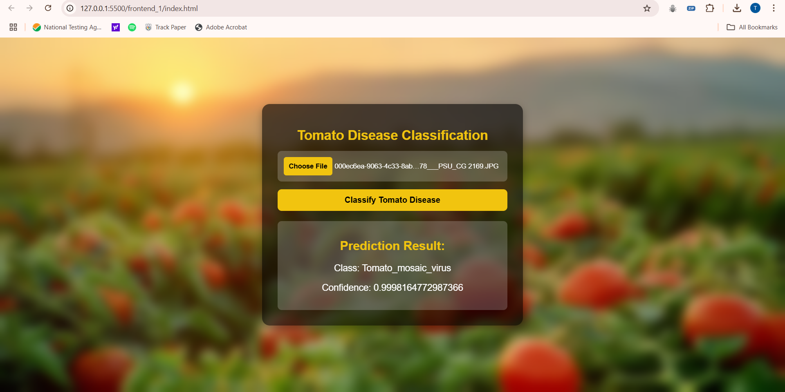

# **Tomato Plant Disease Classification**


*A deep learning project utilizing Convolutional Neural Networks (CNNs) for identifying diseases in tomato plants using a Kaggle dataset.*


---

## **Table of Contents**
1. [About the Problem](#about-the-problem)  
2. [Dataset](#dataset)  
3. [Tools and Technologies](#tools-and-technologies)  
4. [Installation](#installation) 

---

## **About the Problem**
Tomato plants are susceptible to various diseases, which can significantly affect crop yield and quality. Early detection of these diseases can save farmers time and resources.

This project uses **Convolutional Neural Networks (CNNs)**, a state-of-the-art deep learning technique, to classify images of tomato leaves into healthy or diseased categories, automating the disease detection process.

---

## **Dataset**
- **Source**: [Kaggle: Tomato Disease Dataset](https://www.kaggle.com/datasets/arjuntejaswi/plant-village)  
- **Structure**: Contains labeled images of tomato leaves.  
- **Classes**:  
  - Healthy  
  - Tomato Mosaic Virus  
  - Late Blight  
  - Early Blight  
  - ... (list other diseases)

---

## **Tools and Technologies**
- **Programming Language**: Python  
- **Frameworks**: TensorFlow, Keras  
- **Libraries**: NumPy, Pandas, Matplotlib  
- **Other Tools**: Kaggle (dataset), FastAPI, Docker (deployment)

## **Installation**
### **Clone the Repository**
```bash
git clone https://github.com/tarushivasishth/Data-Science/tree/main/tomato_classification
cd tomato_classification
